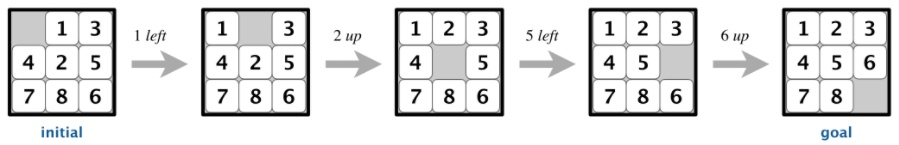
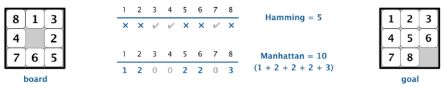
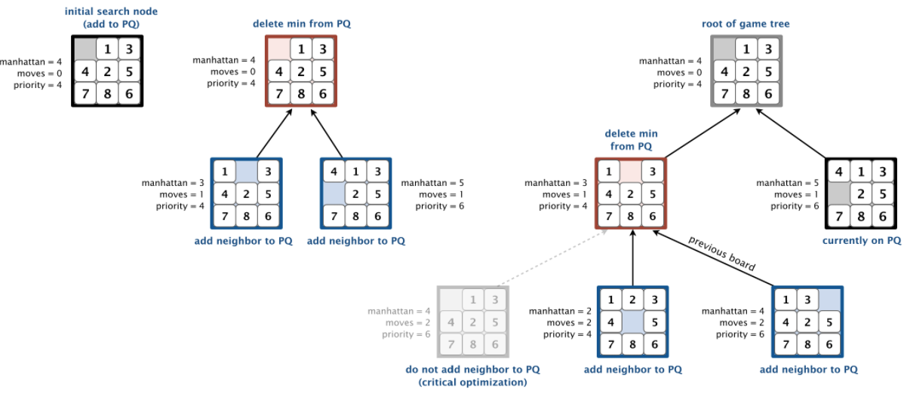
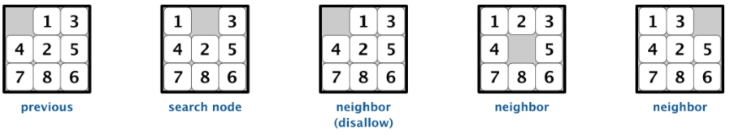
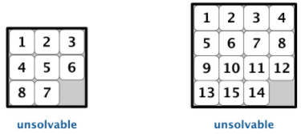

## 8-Puzzle
The 8-puzzle is a sliding puzzle that is played on an N-by-N grid with tiles labeled 1 through N - 1, plus a blank square. The goal is to rearrange the tiles so that they are in row-major order, using as few moves as possible. Tiles can be moved either horizontally or vertically into the blank square. The following diagram shows a sequence of moves from an initial board (left) to the goal board (right).

  

## The Model
Board.java defines a board class which models an n-by-n board with sliding tiles using a two-dimensional array.

The model measures how close a board state is to the goal board using two notions of distance. The Hamming distance between a board and the goal board is the number of tiles in the wrong position. The Manhattan distance between a board and the goal board is the sum of all tiles' vertical and horizontal distances from their respective goal positions.

  

To assess potential moves in solving the puzzle, the model generates an iterable containing all neighbors of a given board state. Depending on the location of the blank square, a board can have 2, 3, or 4 neighbors resulting in a single movement of a tile into the blank square.

  

## A* Search 
Solver.java is an implementation of a solution to the 8-puzzle problem that illustrates a general artificial intelligence methodology known as the A* search algorithm. We define a search node of the game to be a board, the number of moves made to reach the board, and the previous search node. First, we insert the initial search node (the initial board, 0 moves, and a null previous search node) into a priority queue. We then delete from the priority queue the search node with the minimum priority (the node with the minimum sum of its manhattan distance and previous moves), and insert onto the priority queue all of its neighboring search nodes. We repeat this procedure until the search node dequeued corresponds to the goal board. Consequently, when the goal board is dequeued, we have discovered not only a sequence of moves from the initial board to the goal board, but one that makes the fewest moves.

## Game Tree
One way to view the computation is as a game tree, where each search node is a node in the game tree and the children of a node correspond to its neighboring search nodes. The root of the game tree is the initial search node; the internal nodes have already been processed; the leaf nodes are maintained in a priority queue; at each step, the A* algorithm removes the node with the smallest priority from the priority queue and processes it (by adding its children to both the game tree and the priority queue).

For example, the following diagram illustrates the game tree after each of the first three steps of running the A* search algorithm on a 3-by-3 puzzle using the Manhattan priority function.

  

## Optimizations
1. Redundant Neighbors

A* search has one glaringly inefficient feature: search nodes corresponding to the same board are enqueued on the priority queue many times. To reduce unnecessary exploration of useless search nodes, when considering the neighbors of a given search node, we avoid enqueuing a neighbor if its board is the same as the board of the previous search node in the game tree.

  

2. Caching Technique

To avoid recomputing the Manhattan priority of a search node from scratch each time during various priority queue operations, we pre-compute its value when initially constructing the search node -- saving it in an instance variable, and returning the saved value as needed.

## Detecting Unsolvable Boards
Not all initial boards can lead to the goal board by a sequence of moves, including these two:

  

To detect such situations, we use the fact that boards are divided into two equivalence classes with respect to goal reachability:

- Those that can lead to the goal board
- Those that can lead to the goal board if we modify the initial board by swapping any pair of non-blank tiles.

To apply this fact, we run the A* algorithm on two puzzle instances in lockstep — one with the initial board and one with the initial board modified by swapping a pair of tiles (alternating back and forth between exploring search nodes in each of the two game trees). Exactly one of the two will lead to the goal board. If the first of the two puzzles to reach the goal board is the initial puzzle, then we've found the solution. If it's the modified board, then we've confirmed that the initial board is unsolvable.

## Performance
This implementation supports all board methods in time proportional to n^2 or better in the worst case.

## How to Use
Compilation:  javac Solver.java\
Execution:    java Solver filename.txt

where "filename.txt" is the name of a text file local to the project. The first line of the text file should contain the number of rows/columns in the grid, and each following line should be a row of space separated integer values representing the positions of the tiles (see any of the numerous example text files in the project). Solver.java will output the minimum number of moves necessary to solve the board and the series of board states along the optimal solution path to the command line.